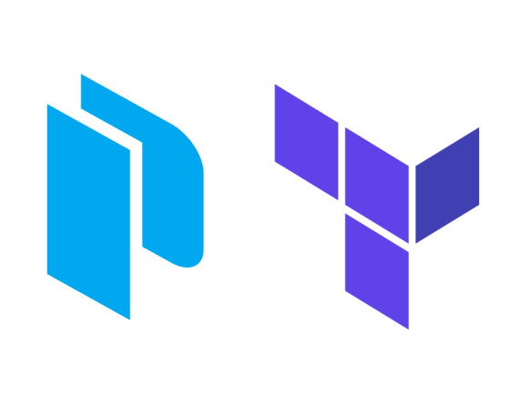

layout: true
class: img-right
background-image: url(../../assets/images/backgrounds/HashiCorp-Content-bkg.png)
background-size: cover
name: slide1
count: true

# Integrating Packer with Terraform

## There are several benefits to integrating Packer with Terraform.

- Infrastructure as Code (IaC) Synergy

- Streamlined Continuous Deployment
  
- Enhanced Scalability and Efficiency

???
- Integrating Packer with Terraform harnesses Infrastructure as Code (IaC) synergy by combining Packer's image creation capabilities with Terraform's infrastructure provisioning, ensuring consistent and reproducible environments. 

- This synergy leads to streamlined continuous deployment, reducing complexities and enabling reliable automation throughout the deployment pipeline.

- The collaboration enhances scalability and operational efficiency by leveraging Packer's immutable machine images, allowing Terraform to efficiently manage infrastructure changes, promote quick scaling, and optimize resource utilization.

---
