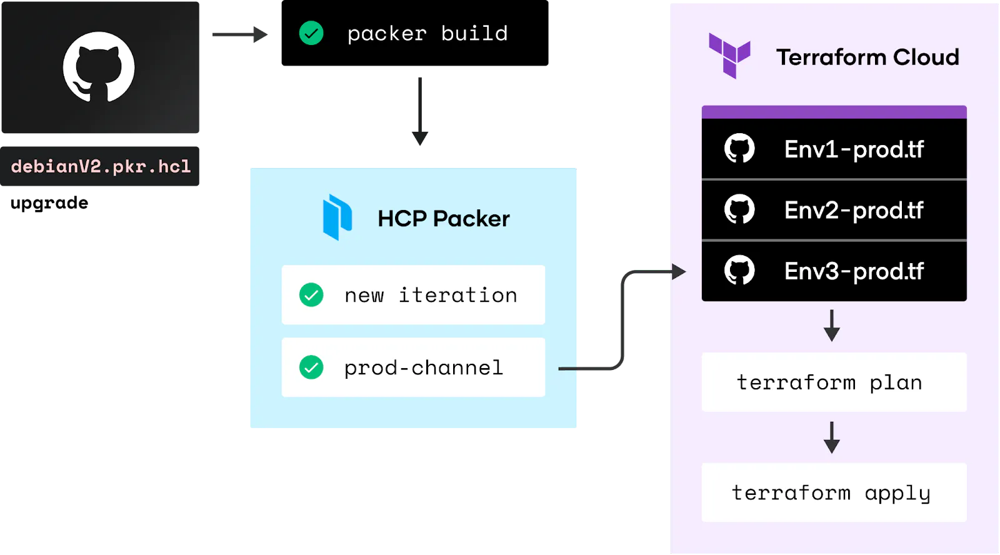

layout: true
class: img-right
background-image: url(../../assets/images/backgrounds/HashiCorp-Content-bkg.png)
background-size: cover
name: slide2

## Infrastructure as Code (IaC) Synergy

Terraform and Packer complement each other in the IaC workflow. Packer enables the creation of pre-configured machine images or templates, ensuring consistency and reliability across various environments. Terraform, on the other hand, manages infrastructure provisioning and configuration. Integrating Packer's image creation with Terraform allows for efficient handling of infrastructure changes, utilizing consistent machine images to deploy and manage infrastructure across different environment.

---
