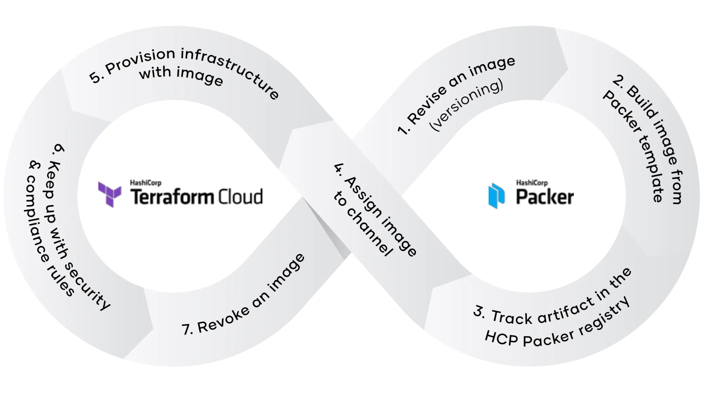

layout: true
class: col-2
background-image: url(../../assets/images/backgrounds/HashiCorp-Content-bkg.png)
background-size: cover
name: slide2
count: true

# Infrastructure as Code (IaC) Synergy

- Terraform and Packer complement each other in the IaC workflow. 
- Integrating Packer's image creation with Terraform allows for efficient handling of infrastructure changes, utilizing consistent machine images to deploy and manage infrastructure across different environment.

---
