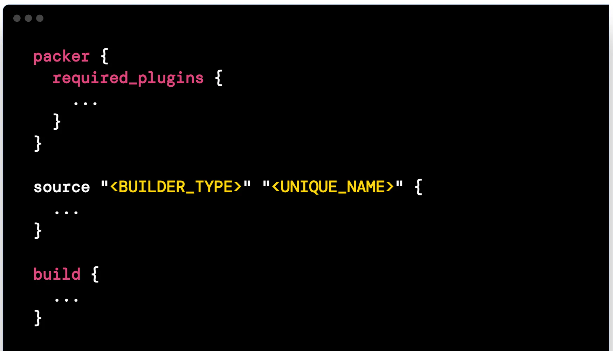

layout: true
class: img-right
background-image: url(../../assets/images/backgrounds/HashiCorp-Content-bkg.png)
background-size: cover
name: slide3
count: true

# Streamlined Continuous Deployment

Combining Packer and Terraform facilitates a streamlined continuous deployment pipeline. Packer builds machine images that encapsulate a predefined configuration and software stack, reducing deployment complexities. Terraform then uses these images as a baseline for provisioning infrastructure in a repeatable and automated manner. This integration promotes faster, more reliable deployments, reducing manual intervention and ensuring consistent infrastructure across development, testing, and production environments.

##Standardize image creation with Packer

???
Discuss how CD is accelerated with Packer integration

---
